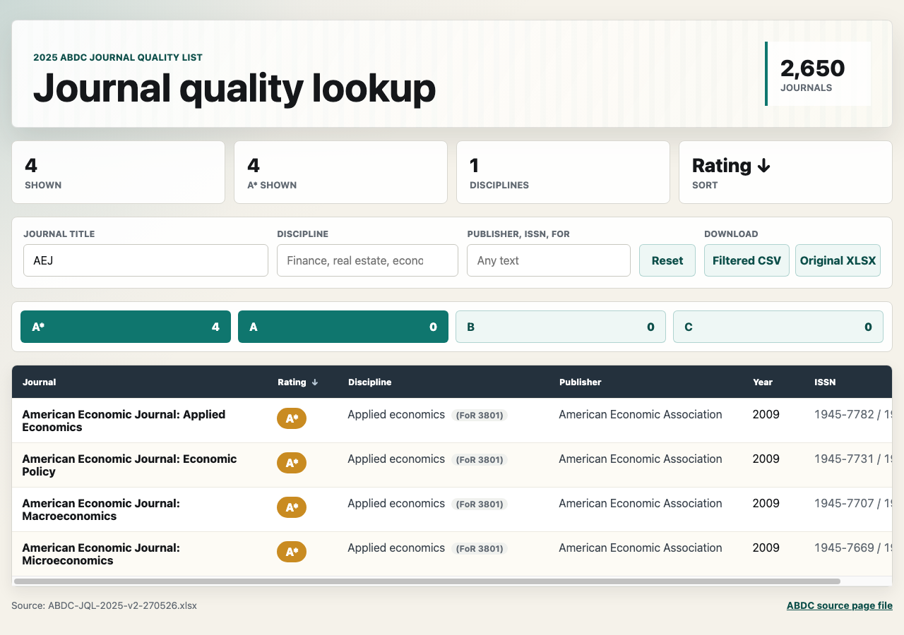

# ABDC Journal Quality List 2025 Viewer

A lightweight, static browser for the [ABDC Journal Quality List](https://abdc.edu.au/abdc-journal-quality-list/). It turns the workbook into a fast single-page lookup tool for journal names, disciplines, and quality ratings.

The page is available as a public website at [lukestein.com/abdc](https://lukestein.com/abdc/)



## Features

- Fast partial-title search, including acronym-style searches such as `AEJ`, `JFE`, `RFS`, `restud`, and `REStat`.
- Comma-separated title, discipline, publisher, ISSN, year, and FoR searches that return the union of matches within each field.
- Quoted journal title searches, such as `"Management Science"`, for exact full-title matches.
- Multi-select rating filters for `A*`, `A`, `B`, and `C`.
- Visible `FT50` and `UTD24` badges and filters for the April 2026 Financial Times Top 50 journal list and UT Dallas Top 24 business journals.
- Sortable table columns with `A*` ranked above `A`.
- Responsive mobile layout with compact journal cards.
- Filtered CSV export plus a link to the original ABDC workbook.

## Files

- `index.html` is the page entry point.
- `styles.css` contains the responsive layout and table styling.
- `app.js` contains filtering, sorting, metrics, and CSV export.
- `data.js` is generated from the official XLSX.
- `tools/extract_abdc.py` regenerates `data.js` from `ABDC-JQL-2025-v2-270526.xlsx`.

## Regenerate Data

```sh
python3 tools/extract_abdc.py
```

The page can be opened directly in a browser from `index.html`; no build step is required.
